### Currently supported boards

APM autopilot port for Navio2 is developed and tested on **Raspberry Pi 2 Model B**.

Previous models such as Raspberry Pi Model A+ and Raspberry Pi Model B+ are electrically compatible, but lack performance to run APM:Copter on 400Hz. These models are sufficient to run developer examples and APM:Rover.

Raspberry Pi Zero is electrically compatible, but has not been tested yet. It is based on the same processor as A+/B+ models and even though it is overclocked its performance is also much lower than Raspberry Pi 2.

It is completely safe to use Navio2 with all boards stated above.

### Attaching Navio2 to a Raspberry Pi

* Install spacers to the top side of Raspberry Pi and fix them with screws from the bottom.
* Connect extension header to the 40-pin gpio port.
* Attach Navio2 to the extension header.
* Fix Navio2 using screws.

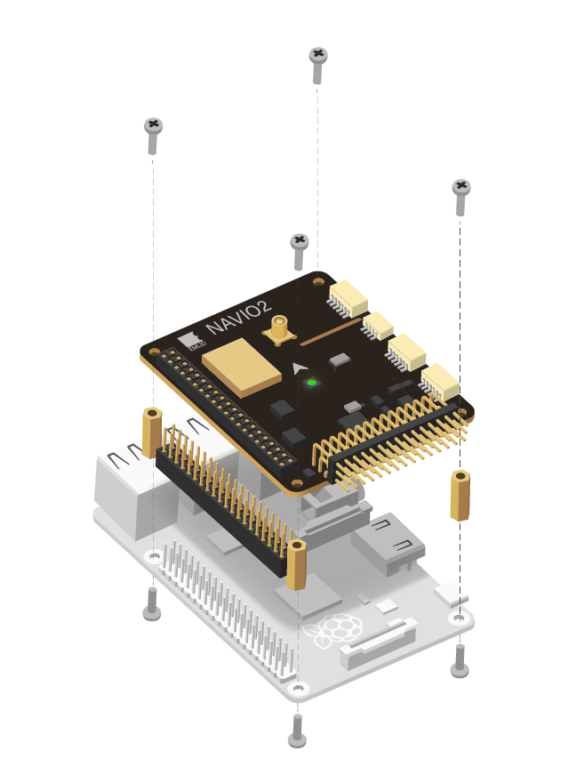

### Powering Navio2

**IMPORTANT: ALL POWER SOURCES SHOULD PROVIDE VOLTAGE IN 4.8-5.3V RANGE, OTHERWISE YOU CAN DAMAGE YOUR NAVIO2 AND RASPBERRY PI.**

Navio2 has three power sources, all of them can be used simultaneously as they are protected by ideal diodes.

***For testing and development purposes***

Connect 5V 1A power adapter to the Raspberry Pi’s microUSB port. Raspberry Pi will provide power to the Navio2.

***In a drone***

Navio2 should be powered by a power module connected to the “POWER” port on Navio2. Navio2 will provide power to the Raspberry Pi.
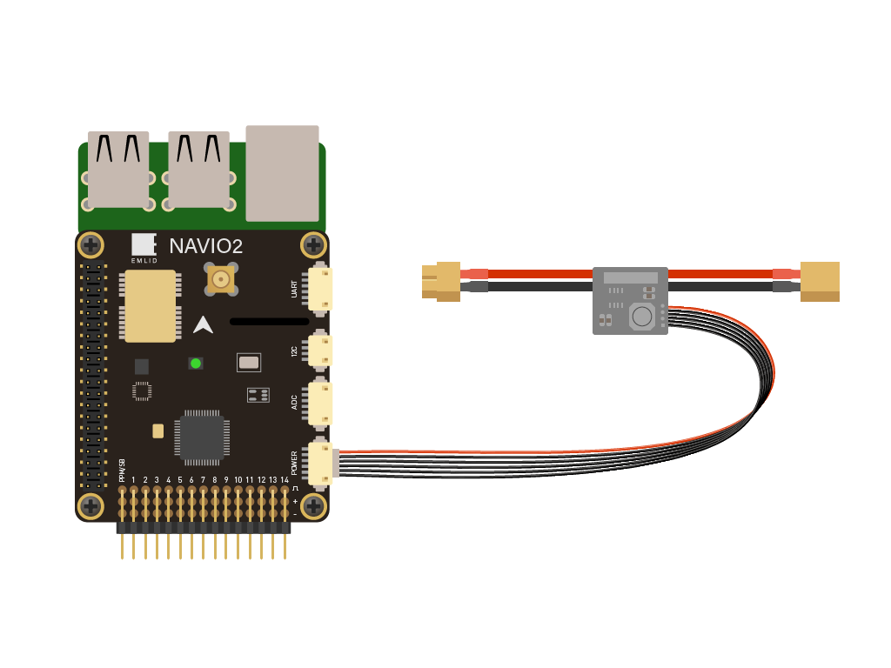

***Redundancy:***

In case of power module failure Navio2 will switch to power from the servo rail.

### Powering servo rail

Power module does not power servos. To provide power to the servo rail plug your drone’s BEC into any free channel on the servo rail. Use BECs that provide voltage in a range of 4.8-5.3V. If you’d like to use high voltage servos use a power separation board.

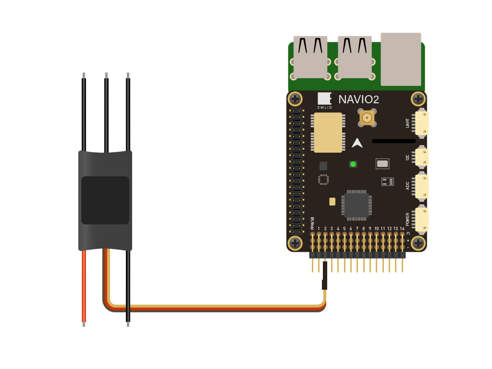

### GNSS antenna
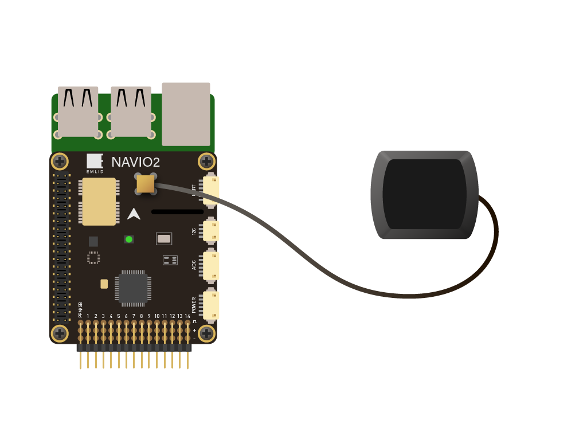

### RC input

Navio2 supports PPM and SBUS signals as an RC input. To connect receivers that do not support PPM output you can use PPM encoder. PPM receiver is powered by Navio2 and does not require power on the servo rail.

**IMPORTANT: Do not connect servos to the RC receiver! Servos can consume a lot of power which RC receiver port may not be able to provide and that may lead to Raspberry Pi and Navio shutting down and even getting damaged.**

Some of the receivers with PPM output:

**For ACCST (most FrSky transmitters):**

* FrSky D4R-II 4ch 2.4Ghz ACCST Receiver
* FrSKY V8R7-SP ACCST 7 Channel RX with composite PPM
* FrSKY D8R-XP

**For FASST (Futaba & some FrSky trasmitters):**

FrSky TFR4 4ch 2.4Ghz Surface/Air Receiver FASST Compatible

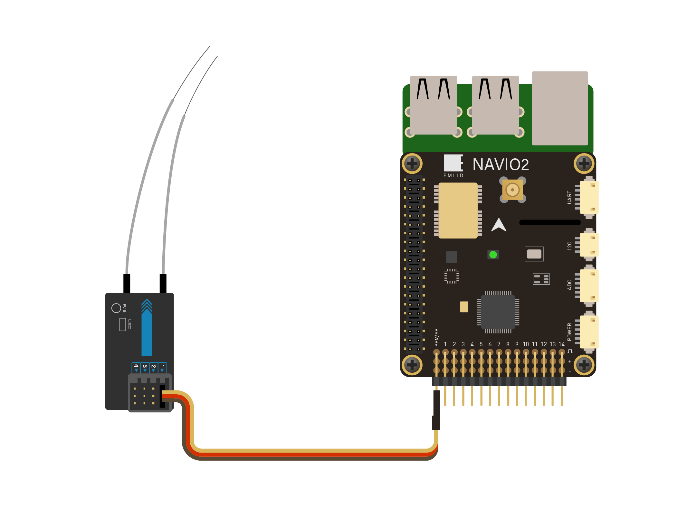

### RC output

***ESCs***

ESCs are connected to RC outputs labeled from 1 to 14 on a 2.54mm header.

Only one ESC power wire (central) should be connected to Navio2 servo rail, otherwise BECs built in ESCs will heat each other.

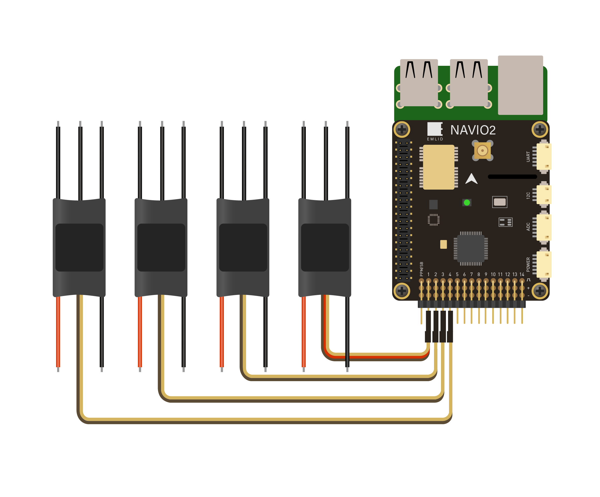

***Servos***

Servos are connected to RC outputs labeled from 1 to 14 on a 2.54mm header.

Power module does not provide power to servos. To provide power to servos connect BEC to the servo rail. BEC would also serve as back-up power supply to Navio2.

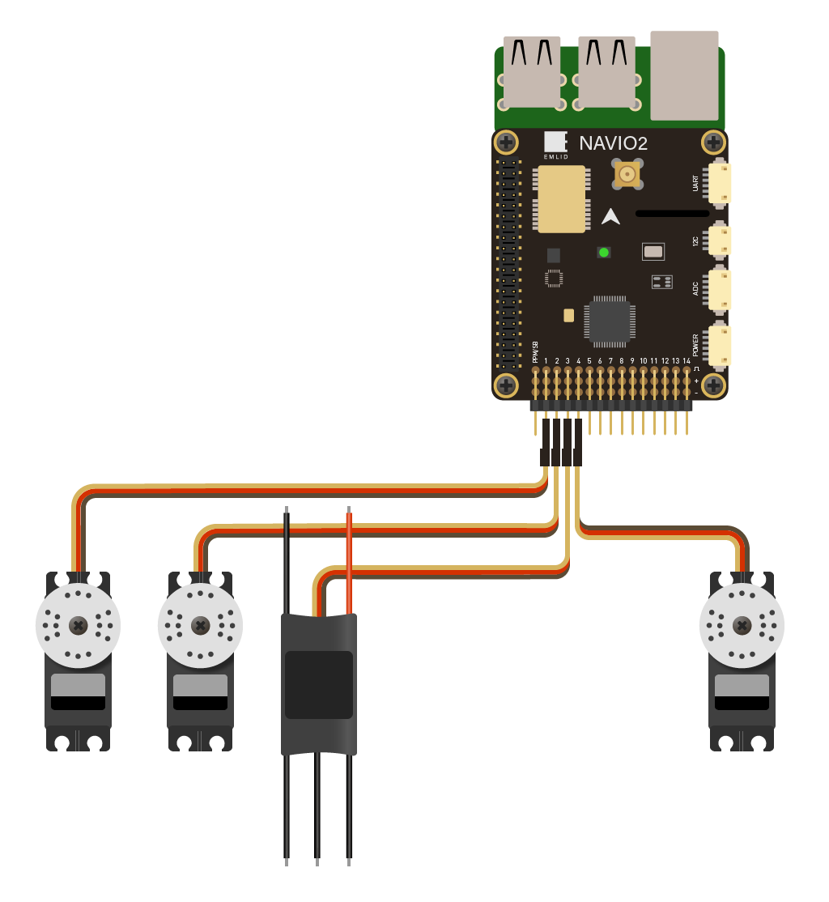

### Telemetry modem

Radio modems can be connected either over UART or over USB.

***UART radio***

For UART port use /dev/ttyAMA0 serial.
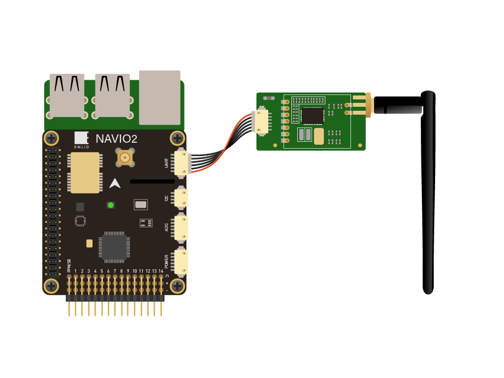

***USB radio***

Use /dev/ttyUSB0 virtual serial port for USB.
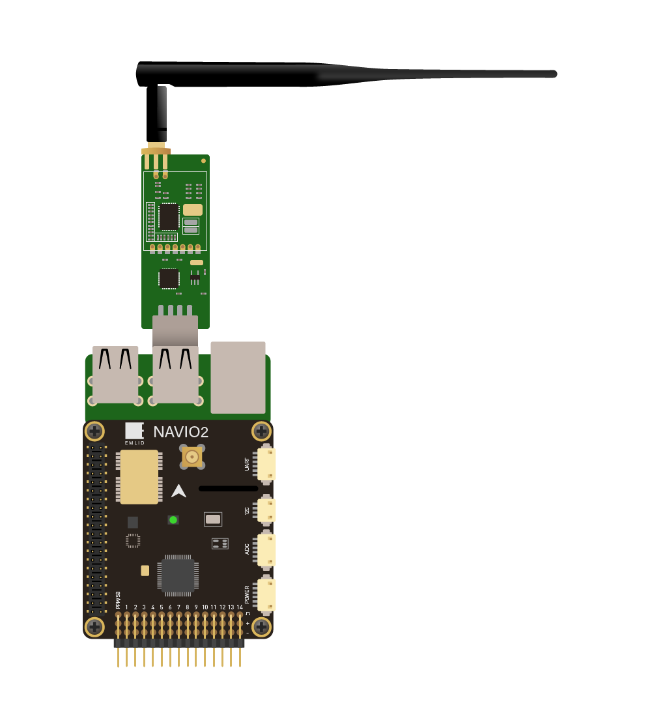

### Typical quadcopter setup based on Navio2

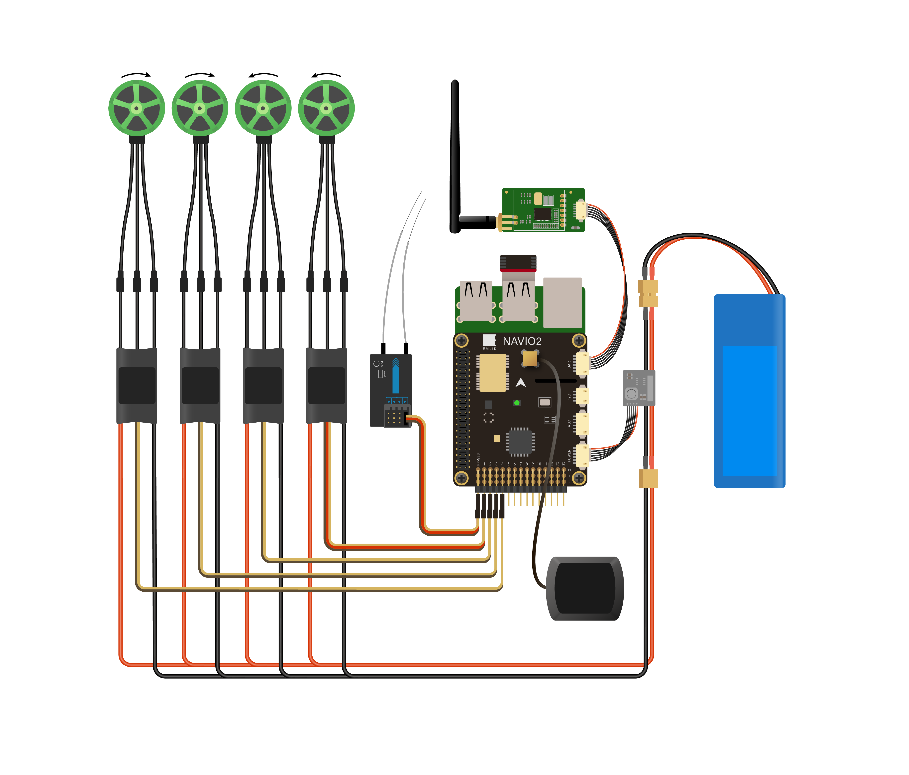

### Barometer UV protection

MS5611 barometer (steel cap IC) is sensitive to UV light and might report sudden jumps in altitude under sunlight. It is very important to cover it with a piece of open cell foam (something like microphone fabric) or put autopilot in a protective case to protect it both from sunlight and airstreams.

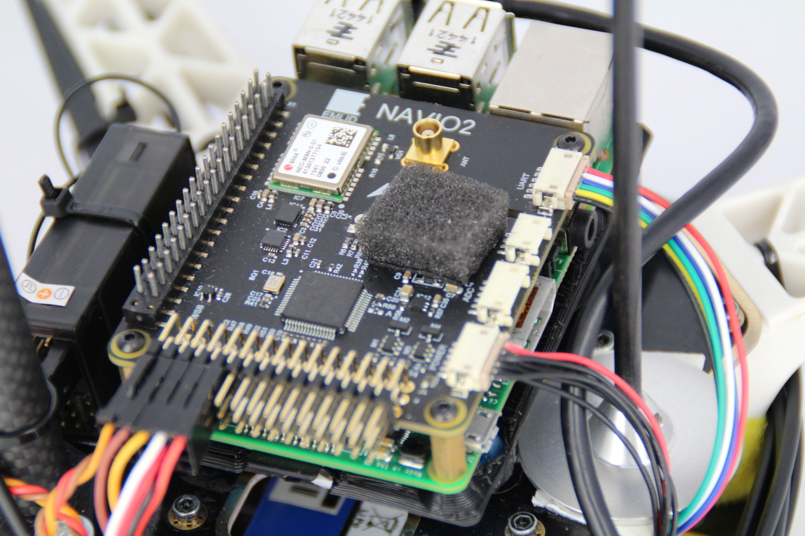
