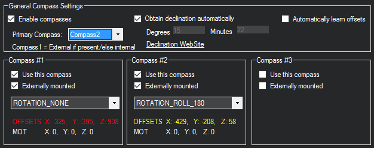

#### APM


You can run APM (ArduPilot) on Raspberry Pi with Navio2. The autopilot's code works directly on Raspberry Pi using the APM's Linux HAL. For APM to work properly please use the configured Raspbian distribution that we provide.  

#### Installing APM

Log in to your Raspberry Pi using SSH or other method.

```bash
pi@navio: ~ $ sudo apt-get update && sudo apt-get install apm-navio2
```

<sub>
You can also install an older version, if you wish.
```bash
pi@navio: ~ $ wget 'https://files.emlid.com/apm/apm-navio2_3.4-unstable.deb' -O apm-navio2.deb
pi@navio: ~ $ sudo dpkg -i apm-navio2.deb
```
</sub>

If you'd like to build the binary yourself please proceed to the [Building from sources](building-from-sources.md).

#### Upgrade

In case of an upgrade follow this [entry](ardupilot-upgrade.md) carefully! 

#### Running APM

Supported vehicle types are:

* APMrover2
* ArduPlane
* ArduCopter-quad
* ArduCopter-tri
* ArduCopter-hexa
* ArduCopter-y6
* ArduCopter-octa
* ArduCopter-octa-quad
* ArduCopter-heli
* ArduCopter-single

To run APM binary type the following in your RPi's console (change ArduCopter-quad to your vehicle type):

```bash
pi@navio: ~ $ sudo ArduCopter-quad -A udp:192.168.1.2:14550
```
If you build APM from sources launch obtained binary file:
```bash
pi@navio: ~ $ sudo ./arducopter -A udp:192.168.1.2:14550
```

Where 192.168.1.2 is the IP address of the device with the Ground Control Station - your laptop, smartphone etc.

Arguments specify serial ports (TCP or UDP can be used instead of serial ports) :

* -A is for primary telemetry
* -B is for external GPS
* -C is for secondary telemetry (it can be used without primary telemetry)
* -E is for secondary external GPS

When using UART for telemetry please note that default baud rates are:
115200 for primary (-A)
57600 for secondary (-C)
3DR Radios are configured for 57600 by default, so te simplest way to connect over them is to run with -C option.
If you would like to transfer telemetry over the UART port on Navio you can specify it like this:

```bash
pi@navio: ~ $ sudo ArduCopter-quad -C /dev/ttyAMA0
```

UDP and serial telemetry can be used simultaneously like this:

```bash
pi@navio: ~ $ sudo ArduCopter-quad -A udp:192.168.1.2:14550 -C /dev/ttyAMA0
```

#### Autostarting APM on boot

To automatically start APM on boot add the following (change -A and -C options to suit your setup) to /etc/rc.local file on your Raspberry Pi:

```bash
pi@navio: ~ $ sudo ArduCopter-quad -A udp:192.168.1.2:14550 -C /dev/ttyAMA0 > /home/pi/startup_log &
```

#### Connecting to the GCS

**APM Planner**

APM Planner is a ground station software for APM. It can be downloaded from the
[ardupilot.com](http://ardupilot.com/downloads/?category=35)

APM Planner listens on UDP port 14550, so it should catch telemetry from the drone automatically.

**MAVProxy**

MAVProxy is a console-oriented ground station software written in Python that can be used standalone or together with APM Planner. It’s well suited for advanced users and developers.

To install MAVProxy use [Download and Installation](http://dronecode.github.io/MAVProxy/html/getting_started/download_and_installation.html) instructions.


To run it specify the --master port, which can be serial, TCP or UDP. It also can perform data passthrough using --out option.

```bash
mavproxy.py --master 192.168.1.2:14550 --console
```

Where 192.168.1.2 is the IP address of the GCS, not RPi.

#### Voltage and current sensing

If you have original power module connected to Navio2, you can get battery voltage and curent readings from it. Simply press on the "Pixhawk Power Module 90A" in APM Planner to setup voltage and current measurement for APM:


After that you can check in full parameter list that:

```bash
BATT_CURR_PIN 3
BATT_VOLT_PIN 2
```

CTRL+C to kill ArduCopter and run again using:

```bash
pi@navio: ~ $ sudo ArduCopter-quad -A udp:192.168.1.2:14550
```

You should see voltage and current values. After that it works everytime.

#### Second compass configuration

Navio2 contains two 9DOF IMU - MPU9250 and LSM9DS1. The latter has lower offsets. If you installed In order to use it, you need to enable it.

Beware that if you compiled from ArduPilot/Copter-3.4-rcX, you don't need to set rotation and enable as an external compass.

After calibration you will get the following results: 


Compass 2 may be set as primary due to lower offsets.
#### Further configuration

**WARNING**
Auxiliary function switches on channels 5-8 are still not supported and could lead to erroneous PWM generation on motors' channels and that's why we do ask to NOT SET AUXILIARY FUNCTION SWITCHES TO RC5..8.

As other APM configuration procedures are very similar for most APM-running autopilot hardware, please use the APM documentation.

*Important*: There is no need to perform "Load Copter Firmware" step as APM is installed using deb package or binary on RPi with Navio. Also, frame type is selected by running the corresponding binary as described above.

[Hardware configuration](http://ardupilot.org/copter/docs/configuring-hardware.html)

[ESC Calibration](http://ardupilot.org/copter/docs/esc-calibration.html)

[Enable RC Failsafe](http://ardupilot.org/copter/docs/radio-failsafe.html)!
