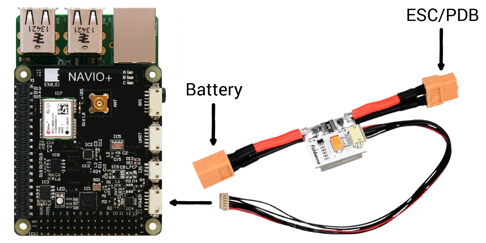

####Currently supported boards

APM autopilot port for Navio+ currently works with:

* Raspberry Pi Model A
* Raspberry Pi Model B
* Raspberry Pi Model A+
* Raspberry Pi Model B+

Ports in progress, but not complete:

* Odroid-C1
* Raspberry Pi 2

It is completely safe to use Navio+ with all boards stated above.

####Attaching Navio+ to a Raspberry Pi

* Install spacers to the top side of Raspberry Pi and fix them with screws from the bottom.
* Connect extension header to the 40-pin gpio port.
* Attach Navio+ to the extension header.
* Fix Navio+ using screws.

####Powering Navio+

Navio+ has three power sources, all of them can be used simultaneously as they are protected by ideal diodes. 

**IMPORTANT: ALL POWER SOURCES SHOULD PROVIDE VOLTAGE IN 4.8-5.3V RANGE, OTHERWISE YOU CAN DAMAGE YOUR NAVIO+ AND RASPBERRY PI.**

***For testing and development purposes:***

Connect 5V 1A power adapter to the Raspberry Pi’s microUSB port. Raspberry Pi will provide power to the Navio+.

***In a drone:***

Navio+ should be powered by a power module connected to the “POWER” port on Navio+. Navio+ will provide power to the Raspberry Pi.

***Redundancy:***

In case of power module failure Navio+ will switch to the power from the servo rail.

####Powering servo rail

Power module does not power servos. To provide power to the servo rail plug your drone’s BEC into any free channel on the servo rail. Use BECs that provide voltage in a range of 4.8-5.3V. If you’d like to use high voltage servos, use a power separation board.
